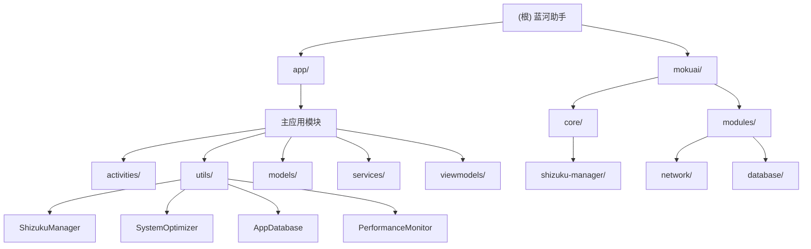

# 蓝河助手项目架构文档

## 变更记录 (Changelog)

**最新扫描时间：** 2025-09-15 13:45:51
- 深度补捞完成：工具类实现、界面布局、模块库详情
- 新增Room数据库架构详情分析
- 完善Shizuku权限管理系统实现
- 补充系统优化器完整功能清单
- 更新模块结构图和导航面包屑

**上次扫描时间：** 2025-09-15 12:04:50
- 自适应初始化架构师首次分析
- 完成项目结构全面扫描
- 生成模块化架构文档

## 项目愿景

蓝河助手（蓝河工具箱）是一款专为Android用户打造的全面系统优化工具，集成了20+实用功能模块，为用户提供一站式的手机优化体验。包含智能优化引擎、性能监控、网络诊断、浏览器、系统管理等核心功能。

## 架构总览

### 技术栈
- **平台：** Android (Kotlin)
- **最低支持：** Android 7.0 (API 24)
- **目标版本：** Android 15 (API 36)
- **架构模式：** MVVM + Repository模式
- **UI框架：** Material Design 3.0
- **数据存储：** Room数据库
- **依赖注入：** 未使用（原生Android开发）
- **特殊权限：** Shizuku框架集成

### 模块结构图



## 模块索引

| 模块路径 | 类型 | 职责描述 | 技术栈 | 状态 |
|---------|------|----------|---------|------|
| `app/` | Android应用 | 主应用模块，包含所有功能实现 | Kotlin, Android SDK | ✅ 完整 |
| `mokuai/` | 模块库 | 可复用的功能模块库 | Java/Kotlin | 🔧 开发中 |
| `app/src/main/java/com/lanhe/gongjuxiang/activities/` | UI层 | 界面控制器，26个Activity | Kotlin, ViewBinding | ✅ 完整 |
| `app/src/main/java/com/lanhe/gongjuxiang/utils/` | 工具层 | 核心工具类和管理器，38个工具类 | Kotlin | ✅ 完整 |
| `app/src/main/java/com/lanhe/gongjuxiang/models/` | 数据层 | 数据模型和实体类 | Kotlin, Room | ✅ 完整 |
| `app/src/main/java/com/lanhe/gongjuxiang/services/` | 服务层 | 后台服务和前台服务 | Kotlin | ✅ 完整 |

## 运行与开发

### 环境要求
- **Android Studio：** 2024.1 或更高版本
- **JDK：** 11
- **Gradle：** 8.12.1
- **Kotlin：** 2.0.21
- **Android Gradle Plugin：** 8.12.1

### 构建步骤
```bash
# 1. 克隆项目
git clone <repository-url>

# 2. 导入Android Studio
# 打开Android Studio并导入项目

# 3. 同步Gradle
./gradlew clean build

# 4. 运行应用
./gradlew installDebug
```

### 签名配置
项目使用发布签名，需要在 `local.properties` 中配置：
```properties
RELEASE_STORE_FILE=keystore.jks
RELEASE_STORE_PASSWORD=<password>
RELEASE_KEY_ALIAS=<alias>
RELEASE_KEY_PASSWORD=<password>
```

## 测试策略

### 单元测试
- **工具：** JUnit 4, Mockito
- **覆盖：** utils包核心工具类
- **位置：** `app/src/test/`

### 仪器测试
- **工具：** Espresso, AndroidX Test
- **覆盖：** Activity和Fragment UI测试
- **位置：** `app/src/androidTest/`

### 测试运行
```bash
# 单元测试
./gradlew test

# 仪器测试
./gradlew connectedAndroidTest
```

## 编码规范

### Kotlin代码风格
- 遵循Kotlin官方编码约定
- 使用ViewBinding替代findViewById
- 优先使用协程处理异步操作
- 使用sealed class处理状态管理

### 命名约定
- **Activity：** `XxxActivity.kt`
- **Fragment：** `XxxFragment.kt` 
- **Adapter：** `XxxAdapter.kt`
- **ViewModel：** `XxxViewModel.kt`
- **工具类：** `XxxManager.kt` / `XxxHelper.kt`

### 架构约定
- 使用Repository模式管理数据
- ViewModel不直接持有Context
- 使用LiveData进行数据观察
- 异常处理统一封装

## AI 使用指引

### 项目上下文
- **领域：** Android系统工具开发
- **用户群体：** Android高级用户和开发者
- **核心价值：** 系统优化、性能提升、功能增强

### 常用任务
1. **功能开发：** 新增工具功能模块
2. **性能优化：** 内存、电池、网络优化
3. **UI改进：** Material Design组件应用
4. **权限管理：** Shizuku权限集成
5. **数据处理：** Room数据库操作

### 代码风格偏好
- 简洁的函数命名
- 完整的错误处理
- 性能优先的实现方案
- 用户体验友好的交互设计

## AI Team Configuration (autogenerated by team-configurator, 2025-09-23)

**Important: YOU MUST USE subagents when available for the task.**

### Detected Tech Stack
- **Platform**: Android (Kotlin)
- **Architecture**: MVVM + Repository pattern  
- **UI Framework**: Material Design 3.0 with ViewBinding
- **Database**: Room (SQLite) with Coroutines
- **Build System**: Gradle (Kotlin DSL) with Android Gradle Plugin 8.12.1
- **Dependencies**: Shizuku framework, Retrofit, OkHttp, Glide, Lottie
- **Special Features**: System-level optimizations, Hidden API access
- **Testing**: JUnit 4, Mockito, Espresso

### AI Team Assignments

| Task | Agent | Notes |
|------|-------|-------|
| Code quality assurance | `code-reviewer` | MANDATORY for all PRs and commits |
| Performance bottlenecks | `performance-optimizer` | System optimization focus |
| Codebase exploration | `code-archaeologist` | Legacy code analysis, refactoring prep |
| API design (REST/JSON) | `api-architect` | Network layer and data contracts |
| Backend logic | `backend-developer` | Kotlin server-side logic |
| Documentation updates | `documentation-specialist` | README, API docs, architecture guides |
| Complex task coordination | `tech-lead-orchestrator` | Multi-step feature development |

### Specialized Patterns

**Android Development Tasks:**
- Use `backend-developer` for Kotlin business logic and data layer
- Use `api-architect` for network API contracts and data models
- Use `performance-optimizer` for system-level optimizations and battery management
- Use `code-archaeologist` for understanding complex utility classes and services

**System Optimization Focus:**
- Battery optimization → `performance-optimizer`
- Memory management → `performance-optimizer` 
- Network efficiency → `api-architect` + `performance-optimizer`
- Shizuku integration → `backend-developer` + `code-reviewer`

**Quality Assurance:**
- Always run `code-reviewer` before merging
- Use `documentation-specialist` for user-facing documentation
- Use `tech-lead-orchestrator` for features spanning multiple modules

---


