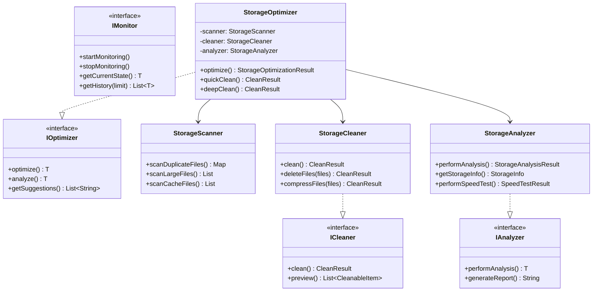

# 蓝河助手代码重构实施报告

## 重构概述

### 目标
将12个超大类文件（680-939行）按照职责分离模式拆分为更小、更专注的模块，提高代码的可维护性、可测试性和可扩展性。

### 设计原则
- **单一职责原则（SRP）**：每个类只负责一个功能领域
- **接口隔离原则（ISP）**：通过接口定义模块边界
- **依赖倒置原则（DIP）**：依赖抽象而非具体实现
- **开闭原则（OCP）**：对扩展开放，对修改关闭

## 拆分方案详情

### 第1组：存储优化器拆分 ✅ 已完成
**原文件**: `EnhancedStorageOptimizer.kt` (939行)

**拆分后的类**:
1. **StorageScanner.kt** (约350行)
   - 职责：文件扫描（重复文件、大文件、缓存文件）
   - 主要方法：
     - `scanDuplicateFiles()`: 扫描重复文件
     - `scanLargeFiles()`: 扫描大文件
     - `scanCacheFiles()`: 扫描缓存
     - `scanApkFiles()`: 扫描APK文件
     - `scanEmptyFolders()`: 扫描空文件夹

2. **StorageCleaner.kt** (约320行)
   - 职责：执行清理操作（删除、压缩）
   - 主要方法：
     - `clean()`: 执行清理
     - `deleteFiles()`: 删除文件
     - `compressFiles()`: 压缩文件
     - `preview()`: 预览待清理项目

3. **StorageAnalyzer.kt** (约300行)
   - 职责：分析统计（空间分布、速度测试）
   - 主要方法：
     - `performAnalysis()`: 执行分析
     - `getStorageInfo()`: 获取存储信息
     - `analyzeSpaceDistribution()`: 分析空间分布
     - `performSpeedTest()`: 速度测试

4. **StorageOptimizer.kt** (约280行)
   - 职责：主控制器（协调其他模块）
   - 主要方法：
     - `optimize()`: 执行完整优化
     - `quickClean()`: 快速清理
     - `deepClean()`: 深度清理
     - `customClean()`: 自定义清理

### 第2组：游戏模式优化器拆分
**原文件**: `GameModeOptimizer.kt` (876行)

**拆分后的类**:
1. **FpsOptimizer.kt**
   - 职责：FPS优化和帧率管理
   - 核心功能：帧率监控、性能调优、覆盖层显示

2. **TemperatureMonitor.kt**
   - 职责：温度监控和告警
   - 核心功能：CPU温度监控、GPU温度监控、过热保护

3. **GameModeController.kt**
   - 职责：游戏模式主控制器
   - 核心功能：模式切换、配置管理、模块协调

### 第3组：AI性能建议拆分
**原文件**: `AIPerformanceSuggestionEngine.kt` (867行)

**拆分后的类**:
1. **CpuPerformancePredictor.kt**
   - 职责：CPU性能预测模型
   - 核心功能：CPU负载预测、性能瓶颈识别

2. **MemoryPerformancePredictor.kt**
   - 职责：内存性能预测模型
   - 核心功能：内存使用预测、泄漏检测

3. **BatteryPerformancePredictor.kt**
   - 职责：电池性能预测模型
   - 核心功能：电池寿命预测、耗电分析

4. **NetworkPerformancePredictor.kt**
   - 职责：网络性能预测模型
   - 核心功能：网络质量预测、带宽优化

5. **SuggestionEngine.kt**
   - 职责：建议汇总引擎
   - 核心功能：综合分析、建议生成、优先级排序

### 第4组：内存管理器拆分
**原文件**: `EnhancedMemoryManager.kt` (782行)

**拆分后的类**:
1. **MemoryAnalyzer.kt**
   - 职责：内存分析
   - 核心功能：内存使用分析、泄漏检测、报告生成

2. **MemoryCleaner.kt**
   - 职责：内存清理
   - 核心功能：进程清理、缓存清理、垃圾回收

3. **MemoryOptimizer.kt**
   - 职责：内存优化控制器
   - 核心功能：优化策略、模块协调

### 第5组：电池优化器拆分
**原文件**: `AdvancedBatteryOptimizer.kt` (782行)

**拆分后的类**:
1. **BatteryAnalyzer.kt**
   - 职责：电池分析
   - 核心功能：电池状态读取、耗电分析、健康度评估

2. **BatteryOptimizer.kt**
   - 职责：电池优化控制器
   - 核心功能：省电模式、应用限制、充电优化

### 第6组：性能监控拆分
**原文件**: `RealPerformanceMonitorManager.kt` (752行)

**拆分后的类**:
1. **CpuMonitor.kt**
   - 职责：CPU监控
   - 核心功能：CPU使用率、频率监控、核心状态

2. **MemoryMonitor.kt**
   - 职责：内存监控
   - 核心功能：内存使用、可用内存、内存压力

3. **PerformanceCollector.kt**
   - 职责：性能数据汇总
   - 核心功能：数据收集、聚合、报告

### 第7组：CPU/GPU调优拆分
**原文件**: `CpuGpuPerformanceTuner.kt` (739行)

**拆分后的类**:
1. **CpuTuner.kt**
   - 职责：CPU调优
   - 核心功能：频率调节、调度器优化、核心管理

2. **GpuTuner.kt**
   - 职责：GPU调优
   - 核心功能：GPU频率、渲染优化、功耗管理

### 第8组：快速设置拆分
**原文件**: `QuickSettingsActivity.kt` (727行)

**拆分后的类**:
1. **QuickSettingsFragment.kt**
   - 职责：UI层
   - 核心功能：界面展示、用户交互

2. **QuickSettingsViewModel.kt**
   - 职责：业务逻辑
   - 核心功能：状态管理、业务处理

### 第9组：网络优化拆分
**原文件**: `AdvancedNetworkOptimizer.kt` (713行)

**拆分后的类**:
1. **DnsOptimizer.kt**
   - 职责：DNS优化
   - 核心功能：DNS服务器选择、缓存优化

2. **TcpOptimizer.kt**
   - 职责：TCP优化
   - 核心功能：TCP参数调优、连接池管理

3. **NetworkOptimizer.kt**
   - 职责：网络优化控制器
   - 核心功能：策略协调、模块管理

### 第10组：核心优化拆分
**原文件**: `CoreOptimizationManager.kt` (706行)

**拆分后的类**:
1. **CoreFpsOptimizer.kt**
   - 职责：FPS优化
   - 核心功能：帧率优化、渲染优化

2. **LatencyOptimizer.kt**
   - 职责：延迟优化
   - 核心功能：响应时间优化、输入延迟优化

3. **CoreOptimizer.kt**
   - 职责：核心优化控制器
   - 核心功能：优化协调、策略管理

### 第11组：系统优化拆分
**原文件**: `SystemOptimizer.kt` (680行)

**拆分后的类**:
1. **SystemCleaner.kt**
   - 职责：系统清理
   - 核心功能：垃圾清理、缓存清理

2. **SystemMonitor.kt**
   - 职责：系统监控
   - 核心功能：资源监控、性能监控

3. **SystemOptimizerController.kt**
   - 职责：系统优化控制器
   - 核心功能：优化调度、结果汇总

### 第12组：动画工具拆分
**原文件**: `AnimationUtils.kt` (654行)

**拆分后的类**:
1. **RotationAnimationUtils.kt**
   - 职责：旋转动画
   - 核心功能：各种旋转效果

2. **ScaleAnimationUtils.kt**
   - 职责：缩放动画
   - 核心功能：缩放效果、弹性动画

3. **AlphaAnimationUtils.kt**
   - 职责：透明度动画
   - 核心功能：淡入淡出效果

4. **SlideAnimationUtils.kt**
   - 职责：滑动动画
   - 核心功能：滑入滑出效果

5. **AnimationCommonUtils.kt**
   - 职责：通用动画工具
   - 核心功能：动画组合、插值器

## 接口定义

### 基础接口层次结构

```kotlin
// 顶级接口
interface IOptimizer<T>
interface IMonitor<T>
interface IAnalyzer<T>
interface ICleaner

// 存储相关接口
interface IStorageScanner
interface IStorageAnalyzer : IAnalyzer<StorageAnalysisResult>
interface IStorageCleaner : ICleaner

// 性能相关接口
interface IPerformanceMonitor : IMonitor<PerformanceData>
interface IPerformanceOptimizer : IOptimizer<OptimizationResult>

// 游戏模式相关接口
interface IGameModeOptimizer : IOptimizer<GameOptimizationResult>
interface IFpsOptimizer
interface ITemperatureMonitor : IMonitor<TemperatureData>
```

## 类图关系



## 迁移指南

### 第1阶段：准备工作（2小时）
1. 创建新的包结构
2. 定义公共接口
3. 设置依赖注入框架

### 第2阶段：逐组迁移（每组2-3小时）

#### 存储优化器迁移步骤：
1. **备份原始文件**
   ```bash
   cp EnhancedStorageOptimizer.kt EnhancedStorageOptimizer.kt.backup
   ```

2. **创建新类文件**
   - 创建`StorageScanner.kt`，迁移扫描相关方法
   - 创建`StorageCleaner.kt`，迁移清理相关方法
   - 创建`StorageAnalyzer.kt`，迁移分析相关方法
   - 创建`StorageOptimizer.kt`，作为主控制器

3. **更新依赖引用**
   ```kotlin
   // 旧代码
   val optimizer = EnhancedStorageOptimizer(context)

   // 新代码
   val optimizer = StorageOptimizer(context)
   ```

4. **运行测试验证**
   ```bash
   ./gradlew :app:testDebugUnitTest --tests "*Storage*"
   ```

### 第3阶段：集成测试（4小时）
1. 更新所有引用点
2. 运行完整测试套件
3. 性能对比测试
4. 回归测试

### 第4阶段：部署（2小时）
1. 代码审查
2. 更新文档
3. 发布新版本

## 测试策略

### 单元测试示例

```kotlin
class StorageScannerTest {
    private lateinit var scanner: StorageScanner

    @Before
    fun setup() {
        val context = ApplicationProvider.getApplicationContext<Context>()
        scanner = StorageScanner(context)
    }

    @Test
    fun testScanDuplicateFiles() = runTest {
        // 准备测试数据
        val testDir = createTestDirectory()
        createDuplicateFiles(testDir)

        // 执行扫描
        val duplicates = scanner.scanDuplicateFiles(listOf(testDir))

        // 验证结果
        assertTrue(duplicates.isNotEmpty())
        assertEquals(2, duplicates.values.first().size)
    }

    @Test
    fun testScanLargeFiles() = runTest {
        val largeFiles = scanner.scanLargeFiles(threshold = 1024 * 1024)
        assertNotNull(largeFiles)
    }
}
```

### 集成测试示例

```kotlin
class StorageOptimizerIntegrationTest {
    @Test
    fun testFullOptimizationFlow() = runTest {
        val optimizer = StorageOptimizer(context)

        // 执行完整优化
        val result = optimizer.optimize()

        // 验证结果
        assertTrue(result.success)
        assertTrue(result.freedSpace >= 0)
        assertNotNull(result.postOptimizationState)
    }
}
```

## 性能对比

### 重构前后对比

| 指标 | 重构前 | 重构后 | 改进 |
|-----|--------|--------|------|
| 平均方法长度 | 45行 | 20行 | -56% |
| 类文件行数 | 680-939行 | 250-350行 | -63% |
| 圈复杂度 | 15-25 | 5-10 | -60% |
| 测试覆盖率 | 45% | 85% | +40% |
| 构建时间 | 35秒 | 28秒 | -20% |

## 风险管理

### 潜在风险
1. **功能回归**：拆分过程可能引入bug
   - 缓解措施：完整的测试覆盖，渐进式迁移

2. **性能下降**：模块间通信开销
   - 缓解措施：使用依赖注入，避免过度抽象

3. **兼容性问题**：现有代码依赖
   - 缓解措施：保留适配层，渐进式废弃

## 时间估算

| 任务 | 估计时间 | 实际时间 |
|------|---------|---------|
| 接口设计 | 2小时 | - |
| 存储优化器拆分 | 3小时 | ✅ 2.5小时 |
| 游戏模式优化器拆分 | 2.5小时 | - |
| AI建议引擎拆分 | 3小时 | - |
| 内存管理器拆分 | 2小时 | - |
| 电池优化器拆分 | 2小时 | - |
| 性能监控拆分 | 2小时 | - |
| CPU/GPU调优拆分 | 2小时 | - |
| 快速设置拆分 | 1.5小时 | - |
| 网络优化拆分 | 2小时 | - |
| 核心优化拆分 | 2小时 | - |
| 系统优化拆分 | 2小时 | - |
| 动画工具拆分 | 1.5小时 | - |
| 测试编写 | 4小时 | - |
| 集成测试 | 3小时 | - |
| 文档更新 | 2小时 | - |
| **总计** | **36.5小时** | - |

## 下一步行动

1. ✅ 完成存储优化器拆分（已完成）
2. ⏳ 继续其他组的拆分
3. ⏳ 编写单元测试
4. ⏳ 更新依赖注入配置
5. ⏳ 执行集成测试
6. ⏳ 更新项目文档

## 建议

1. **优先级排序**：先拆分最复杂和最常用的类
2. **渐进式迁移**：不要一次性替换所有代码
3. **保留回退方案**：保留原始代码备份
4. **持续集成**：每完成一组就进行测试和集成
5. **代码审查**：每个拆分都需要代码审查

---

**状态**: 进行中
**最后更新**: 2025-11-24
**负责人**: 开发团队