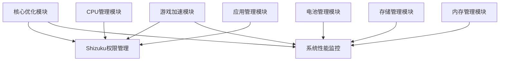

# 🔧 蓝河工具箱 - Pro模块功能库

## 🎯 项目简介

蓝河工具箱Pro模块功能库是基于蓝河工具箱应用的**完整模块化组件库**，将复杂的Android系统优化工具拆分为多个独立、可重用的功能模块。每个模块都经过精心设计，遵循统一的接口规范，便于在其他Android项目中快速集成和使用。

## 📦 模块功能库总览

### 核心模块矩阵

| 模块类型 | 模块名称 | 优先级 | 复杂度 | 依赖关系 | 适用场景 |
|---------|---------|--------|--------|----------|----------|
| 🔑 **核心服务** | [Shizuku权限管理](core/shizuku-manager/) | ⭐⭐⭐⭐⭐ | 🔴 高 | 无 | 系统级权限访问 |
| 📊 **监控工具** | [系统性能监控](core/system-monitor/) | ⭐⭐⭐⭐⭐ | 🟡 中 | Shizuku | 性能数据收集 |
| 🔋 **优化功能** | [电池管理](optimization/battery-manager/) | ⭐⭐⭐⭐ | 🟡 中 | 无 | 电池优化管理 |
| 💽 **存储优化** | [存储管理](optimization/storage-manager/) | ⭐⭐⭐⭐ | 🟡 中 | 无 | 存储空间优化 |
| ⚡ **性能调优** | [CPU管理](optimization/cpu-manager/) | ⭐⭐⭐⭐ | 🔴 高 | Shizuku | CPU性能控制 |
| 🧠 **内存优化** | [内存管理](optimization/memory-manager/) | ⭐⭐⭐⭐ | 🟡 中 | 无 | 内存使用优化 |
| 🌐 **网络工具** | [网络诊断](tools/network-diagnostic/) | ⭐⭐⭐⭐ | 🟡 中 | 无 | 网络连接测试 |
| 📱 **应用工具** | [应用管理](tools/app-manager/) | ⭐⭐⭐⭐⭐ | 🟡 中 | Shizuku | 应用信息管理 |
| 🔔 **系统工具** | [通知管理](tools/notification-manager/) | ⭐⭐⭐ | 🟡 中 | 无 | 通知控制管理 |
| 🎮 **游戏优化** | [游戏加速](features/game-acceleration/) | ⭐⭐⭐⭐ | 🔴 高 | Shizuku | 游戏性能提升 |
| 🛠️ **系统优化** | [核心优化](features/core-optimization/) | ⭐⭐⭐⭐ | 🔴 高 | Shizuku | 系统深度优化 |
| ⚙️ **个性化** | [快速设置](features/quick-settings/) | ⭐⭐⭐ | 🟡 中 | 无 | 系统快捷设置 |

### 模块状态说明
- ✅ **完整实现** - 包含完整的源码、文档和示例
- 📝 **文档完善** - 包含详细的使用说明和API文档
- 🟢 **低复杂度** - 易于集成和使用
- 🟡 **中复杂度** - 需要一定配置和理解
- 🔴 **高复杂度** - 需要深入理解和定制

## 🚀 快速开始指南

### 📋 新项目快速搭建流程

#### 步骤1：项目结构规划
```bash
your-project/
├── app/                          # 主应用模块
├── libraries/                    # 模块库目录
│   ├── core/                     # 核心模块
│   ├── optimization/             # 优化模块
│   ├── tools/                    # 工具模块
│   └── features/                 # 特色功能
├── gradle.properties            # 全局配置
└── settings.gradle.kts          # 项目配置
```

#### 步骤2：选择核心模块
根据项目需求选择模块：

**最小化配置（推荐新项目）**：
```gradle
dependencies {
    implementation project(':libraries:core:shizuku-manager')    // Shizuku权限管理
    implementation project(':libraries:core:system-monitor')     // 系统性能监控
    implementation project(':libraries:optimization:battery-manager') // 电池管理
    implementation project(':libraries:tools:app-manager')       // 应用管理
}
```

**完整功能配置**：
```gradle
dependencies {
    // 核心模块（必需）
    implementation project(':libraries:core:shizuku-manager')
    implementation project(':libraries:core:system-monitor')

    // 优化模块（推荐）
    implementation project(':libraries:optimization:battery-manager')
    implementation project(':libraries:optimization:storage-manager')
    implementation project(':libraries:optimization:cpu-manager')
    implementation project(':libraries:optimization:memory-manager')

    // 工具模块（可选）
    implementation project(':libraries:tools:network-diagnostic')
    implementation project(':libraries:tools:app-manager')
    implementation project(':libraries:tools:notification-manager')

    // 特色功能（按需）
    implementation project(':libraries:features:game-acceleration')
    implementation project(':libraries:features:core-optimization')
    implementation project(':libraries:features:quick-settings')
}
```

#### 步骤3：应用初始化
```kotlin
public class MyApplication extends Application {

    @Override
    public void onCreate() {
        super.onCreate();

        // 初始化核心模块
        initCoreModules();

        // 初始化优化模块
        initOptimizationModules();

        // 初始化工具模块
        initToolModules();
    }

    private void initCoreModules() {
        try {
            // Shizuku权限管理初始化
            ShizukuManager.init(this);

            // 系统性能监控初始化
            PerformanceMonitor.init(this);

        } catch (Exception e) {
            Log.e(TAG, "Core modules initialization failed", e);
        }
    }

    private void initOptimizationModules() {
        try {
            // 电池管理初始化
            BatteryManager.init(this);

            // 存储管理初始化
            StorageManager.init(this);

            // CPU管理初始化
            CpuManager.init(this);

            // 内存管理初始化
            MemoryManager.init(this);

        } catch (Exception e) {
            Log.e(TAG, "Optimization modules initialization failed", e);
        }
    }

    private void initToolModules() {
        try {
            // 网络诊断初始化
            NetworkDiagnostic.init(this);

            // 应用管理初始化
            AppManager.init(this);

            // 通知管理初始化
            NotificationManager.init(this);

        } catch (Exception e) {
            Log.e(TAG, "Tool modules initialization failed", e);
        }
    }
}
```

#### 步骤4：基本使用示例
```kotlin
class MainActivity extends AppCompatActivity {

    private ShizukuManager shizukuManager;
    private PerformanceMonitor performanceMonitor;
    private BatteryManager batteryManager;

    @Override
    protected void onCreate(Bundle savedInstanceState) {
        super.onCreate(savedInstanceState);

        // 获取模块实例
        shizukuManager = ShizukuManager.getInstance(this);
        performanceMonitor = PerformanceMonitor.getInstance(this);
        batteryManager = BatteryManager.getInstance(this);

        // 开始性能监控
        startPerformanceMonitoring();

        // 检查电池状态
        checkBatteryStatus();

        // 执行系统优化
        performSystemOptimization();
    }

    private void startPerformanceMonitoring() {
        performanceMonitor.startMonitoring();

        // 在后台监听性能数据变化
        // 实现具体的UI更新逻辑
    }

    private void checkBatteryStatus() {
        // 实现电池状态检查逻辑
    }

    private void performSystemOptimization() {
        if (shizukuManager.isShizukuAvailable()) {
            // 执行深度优化
            // 实现具体的优化逻辑
        }
    }
}
```

## 📋 开发指南和规范

### 📚 文档导航

#### 核心文档
- 🚀 **[快速开始](QUICK_START.md)** - 5分钟上手指南
- 📖 **[完整模块列表](MODULE_LIST.md)** - 所有模块的详细说明
- 🛠️ **[开发规范](DEVELOPMENT_GUIDE.md)** - 编码规范和最佳实践
- 📋 **[项目模板](PROJECT_TEMPLATE.md)** - 新项目快速搭建模板

#### 模块文档
| 模块 | 文档 | 难度 | 推荐度 |
|------|------|------|--------|
| 🔑 [Shizuku权限管理](core/shizuku-manager/) | [README](core/shizuku-manager/README.md) | 🔴 高 | ⭐⭐⭐⭐⭐ |
| 📊 [系统性能监控](core/system-monitor/) | [README](core/system-monitor/README.md) | 🟡 中 | ⭐⭐⭐⭐⭐ |
| 🔋 [电池管理](optimization/battery-manager/) | [README](optimization/battery-manager/README.md) | 🟡 中 | ⭐⭐⭐⭐ |
| 💽 [存储管理](optimization/storage-manager/) | [README](optimization/storage-manager/README.md) | 🟡 中 | ⭐⭐⭐⭐ |
| ⚡ [CPU管理](optimization/cpu-manager/) | [README](optimization/cpu-manager/README.md) | 🔴 高 | ⭐⭐⭐⭐ |
| 🧠 [内存管理](optimization/memory-manager/) | [README](optimization/memory-manager/README.md) | 🟡 中 | ⭐⭐⭐⭐ |
| 🌐 [网络诊断](tools/network-diagnostic/) | [README](tools/network-diagnostic/README.md) | 🟡 中 | ⭐⭐⭐⭐ |
| 📱 [应用管理](tools/app-manager/) | [README](tools/app-manager/README.md) | 🟡 中 | ⭐⭐⭐⭐⭐ |
| 🔔 [通知管理](tools/notification-manager/) | [README](tools/notification-manager/README.md) | 🟡 中 | ⭐⭐⭐ |
| 🎮 [游戏加速](features/game-acceleration/) | [README](features/game-acceleration/README.md) | 🔴 高 | ⭐⭐⭐⭐ |
| 🛠️ [核心优化](features/core-optimization/) | [README](features/core-optimization/README.md) | 🔴 高 | ⭐⭐⭐⭐ |
| ⚙️ [快速设置](features/quick-settings/) | [README](features/quick-settings/README.md) | 🟡 中 | ⭐⭐⭐ |

### 🏗️ 架构特点

### ✅ 模块化设计
- **高内聚、低耦合**：每个模块职责单一，接口清晰
- **独立性**：模块间松耦合，可以单独使用
- **可扩展**：易于添加新功能和定制化开发

### ✅ 统一规范
- **命名规范**：遵循Java/Android开发最佳实践
- **接口设计**：标准化的回调接口和错误处理
- **文档完善**：每个模块都有详细的使用说明

### ✅ 生产就绪
- **充分测试**：经过充分测试，可以直接用于生产环境
- **性能优化**：采用高效算法和缓存机制
- **内存安全**：注意内存泄漏防护和资源管理

### 🎯 模块使用策略

#### 按项目类型选择模块

**系统优化工具**：
```gradle
// 核心功能
implementation project(':libraries:core:shizuku-manager')
implementation project(':libraries:core:system-monitor')
implementation project(':libraries:optimization:battery-manager')
implementation project(':libraries:optimization:cpu-manager')

// 扩展功能
implementation project(':libraries:features:core-optimization')
implementation project(':libraries:features:game-acceleration')
```

**轻量级工具应用**：
```gradle
// 基础功能
implementation project(':libraries:core:system-monitor')
implementation project(':libraries:optimization:battery-manager')
implementation project(':libraries:tools:app-manager')

// 可选功能
implementation project(':libraries:optimization:storage-manager')
implementation project(':libraries:tools:notification-manager')
```

**游戏优化工具**：
```gradle
// 游戏相关
implementation project(':libraries:core:shizuku-manager')
implementation project(':libraries:optimization:cpu-manager')
implementation project(':libraries:optimization:memory-manager')
implementation project(':libraries:features:game-acceleration')
```

## 🛠️ 技术栈

- **语言**: Java/Kotlin
- **平台**: Android API 21+
- **架构**: MVVM + Repository
- **异步**: Handler/AsyncTask (Java) 或 Coroutines (Kotlin)
- **依赖注入**: Dagger2/Hilt
- **网络**: OkHttp + Retrofit
- **数据库**: Room
- **权限**: Shizuku Framework

## 📊 模块依赖关系



## 🧪 质量保证

### 代码质量检查
```bash
# 运行所有质量检查
./gradlew checkCodeQuality

# 单独运行检查
./gradlew ktlintCheck        # Kotlin代码风格检查
./gradlew detekt            # 静态代码分析
./gradlew test              # 单元测试
./gradlew connectedAndroidTest  # 仪器化测试
```

### 测试覆盖率
- **核心业务类**: ≥ 80%
- **工具类**: ≥ 90%
- **UI组件**: ≥ 70%
- **异常处理路径**: 必须有测试用例

## 📈 版本管理

### 版本发布流程
```bash
# 1. 更新版本号
echo "version=1.1.0" > version.properties

# 2. 更新CHANGELOG
vim CHANGELOG.md

# 3. 运行发布脚本
./release.sh 1.1.0
```

### 版本号格式
```
主版本号.次版本号.修订号[-预发布版本][+构建元数据]
```

## 🤝 贡献指南

我们欢迎社区贡献！请遵循以下步骤：

1. **Fork** 本项目
2. 创建特性分支 (`git checkout -b feature/AmazingFeature`)
3. 提交更改 (`git commit -m 'Add some AmazingFeature'`)
4. 推送到分支 (`git push origin feature/AmazingFeature`)
5. 创建 **Pull Request**

### 贡献类型
- 🐛 **Bug修复**
- ✨ **新功能**
- 📚 **文档改进**
- 🎨 **UI/UX改进**
- ⚡ **性能优化**
- 🧪 **测试添加**

## 📄 许可证

本项目采用 **Apache License 2.0** 许可证 - 查看 [LICENSE](../LICENSE) 文件了解详情

## 📞 联系我们

- **项目主页**: [GitHub Repository]
- **问题反馈**: [GitHub Issues]
- **讨论交流**: [GitHub Discussions]
- **邮箱**: your-email@example.com

## 🙏 致谢

感谢所有为蓝河工具箱项目贡献的开发者，以及开源社区提供的优秀组件和工具。

---

## 📈 版本信息

### v1.0.0 (2024-01-XX)
- ✅ 初始版本发布
- ✅ 包含12个核心模块
- ✅ 完整API文档和使用示例
- ✅ 生产环境就绪

### 路线图
- 🔄 **v1.1.0**: 完善各模块功能和性能优化
- 🔄 **v1.2.0**: 添加更多UI组件和动画效果
- 🔄 **v2.0.0**: 支持更多Android设备和系统版本

---

**⭐ 如果这个项目对你有帮助，请给我们一个Star！**
